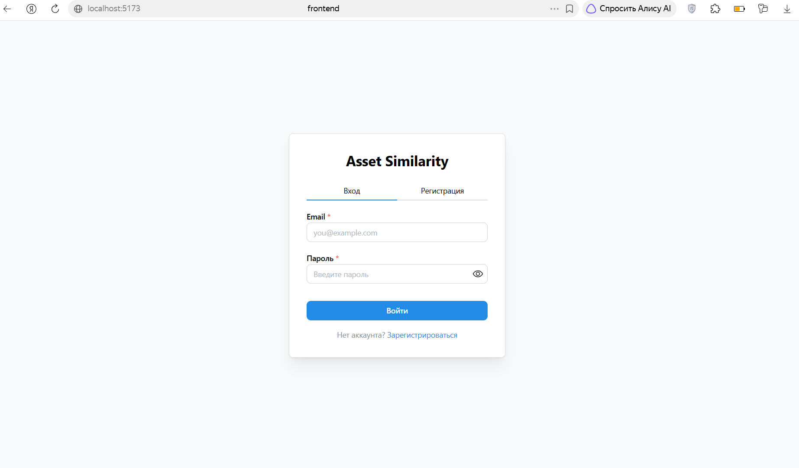
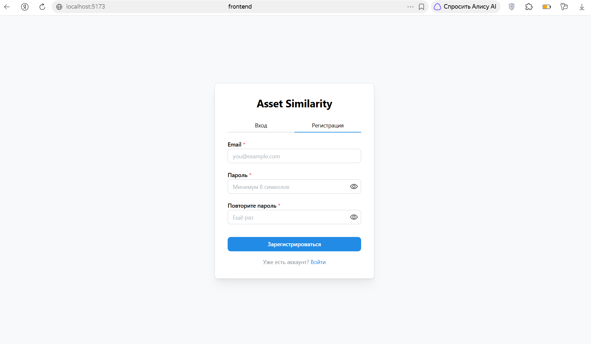
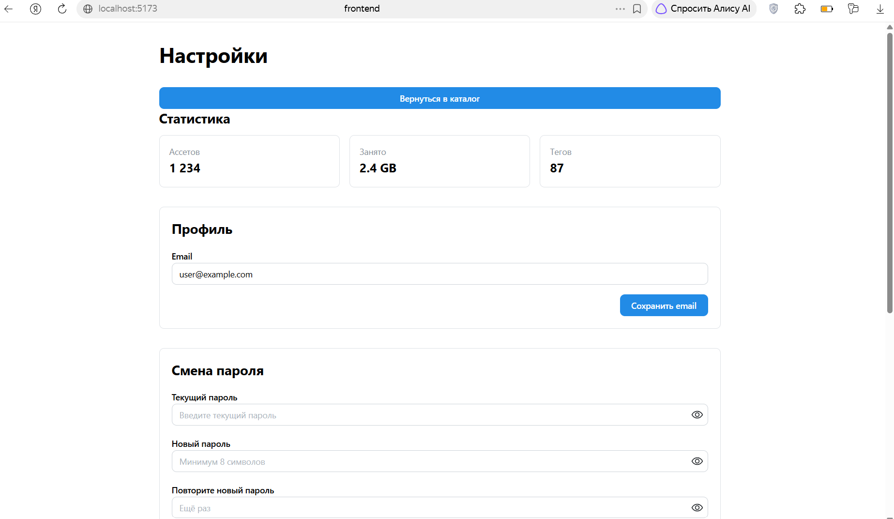
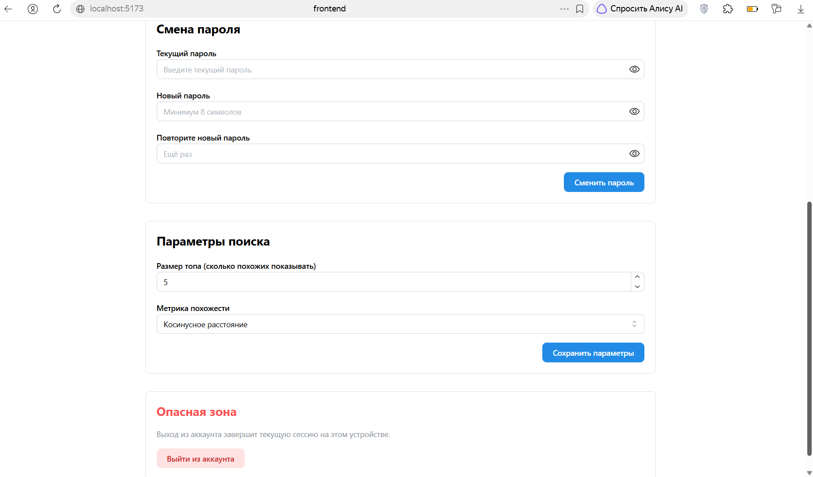
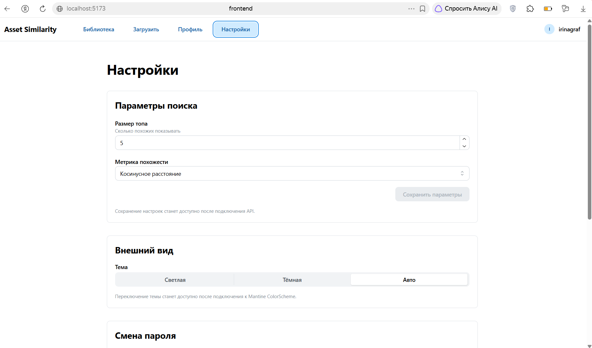
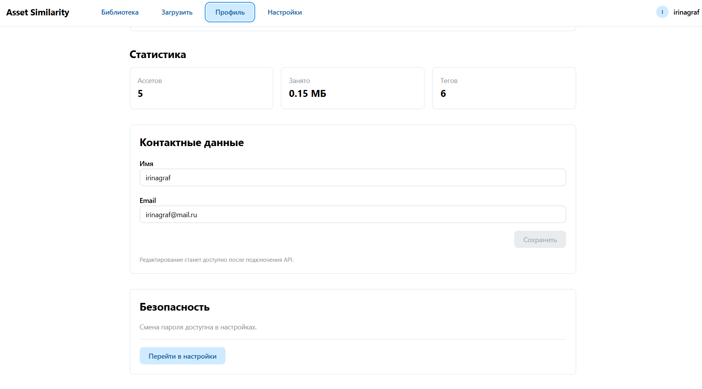
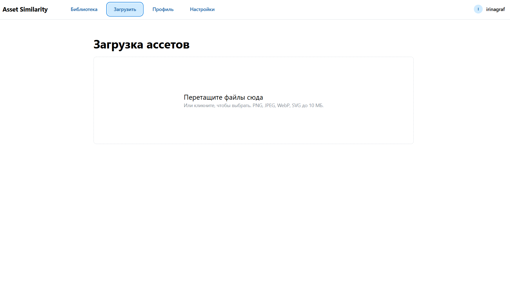
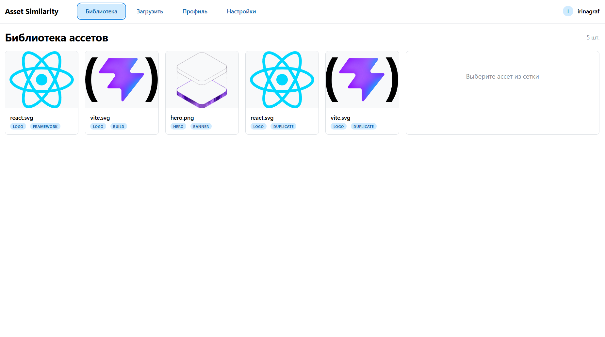
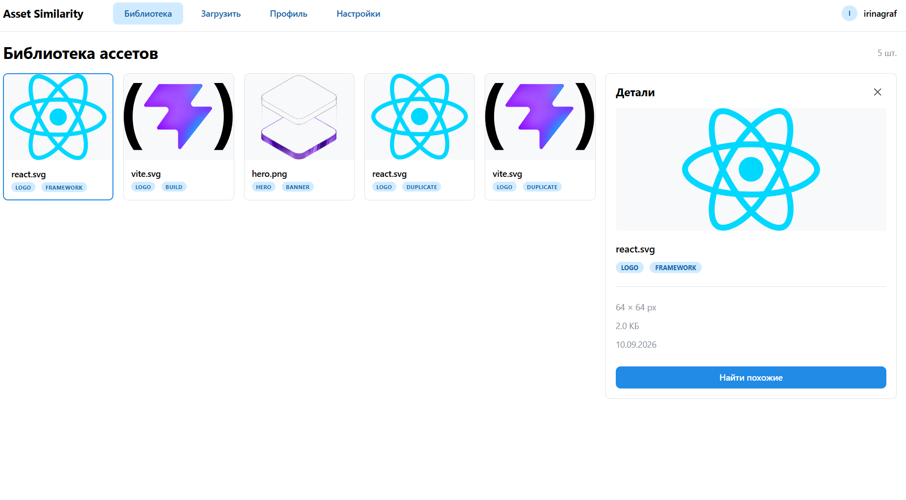
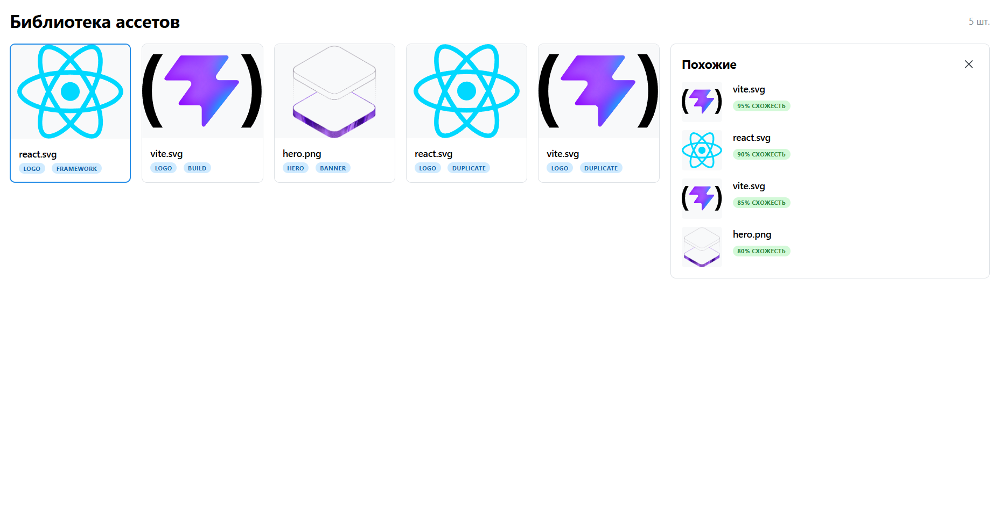

# MasterAssets
Данный репозиторий представляет собой реализацию индивидуального проекта по дисциплине FullStack (Разработка полного цикла). Тема: "Поиск стилистически похожих графических ассетов". Имеет высокий уровень актуальности, так как заменяет множество часов поиска парой минут взаимодействия с удобным инструментом.

## Технологический стек

| Слой          | Технологии                              |
|---------------|-----------------------------------------|
| База данных   | PostgreSQL 16                           |
| Управление БД | DBeaver, Alembic                        |
| Бэкенд        | FastAPI, SQLAlchemy, JWT                |
| Фронтенд      | React, Vite, Axios, TypeScript, Mantine |
| Дизайн        | Figma, Mantine                          |

## Лабораторная работа № 1
### Основные экраны
Auth — вход + регистрация в одном экране (табы).

Библиотека — грид + правая панель + модальное окно загрузки.

Настройки — смена пароля, параметры поиска.

### Основные пользовательские сценарии
#### Группа 1: Вход

Как пользователь, я хочу зарегистрироваться по email+паролю, чтобы получить доступ к своей библиотеке.

Как пользователь, я хочу войти в существующий аккаунт, чтобы продолжить работу.

Как пользователь, я хочу выйти из аккаунта, чтобы обезопасить данные на общем устройстве.

#### Группа 2: Библиотека

Как пользователь, я хочу увидеть общую библиотеку ассетов, чтобы понять, что вообще есть.

Как пользователь, я хочу выбрать ассет из библиотеки, чтобы посмотреть детали (превью, метаданные, дата загрузки).

Как пользователь, я хочу выбрать ассет и нажать «найти похожие», чтобы увидеть топ-5 стилистически близких.

Как пользователь, я хочу посмотреть результат поиска, сравнить варианты и определиться с выбором.

Как пользователь, я хочу вернуться из результатов к библиотеке, чтобы продолжить работу.

Как пользователь, я хочу фильтровать/сортировать библиотеку (по дате, имени, тегам) — чтобы быстрее находить.

Как пользователь, я хочу удалить ассет, который добавил самостоятельно, если он больше не нужен.

#### Группа 3: Пополнение библиотеки

Как пользователь, я хочу загрузить одно изображение в общую базу через drag-and-drop, чтобы добавить его в библиотеку.

Как пользователь, я хочу загрузить пачку изображений (папку), чтобы не делать это по одному.

Как пользователь, я хочу видеть прогресс загрузки и эмбеддинга (потому что CLIP на 100 картинок работает несколько секунд).

Как пользователь, я хочу увидеть ошибки (битый файл, неподдерживаемый формат, дубль), чтобы понимать, что не так.

Как пользователь, я хочу добавить теги/описание к ассету, чтобы потом искать по ним.

#### Группа 4: Профиль / настройки

Как пользователь, я хочу сменить пароль или email.

Как пользователь, я хочу настроить параметры поиска (например, метрику похожести, размер топ-N).

Как пользователь, я хочу видеть статистику (сколько ассетов, сколько места занято).

### Скриншоты интерфейса (Версия 1)

### Инструкция по запуску фронтенда
1. Установите необходимые Node.js, React, Vite, TypeScript компоненты.
2. Перейдите в папку /frontend проекта.
3. Запустите командой в терминале: npm run dev (пока для разработки).

### Скриншоты интерфейса (Версия 2)

## Лабораторная работа № 2
## Модели данных

### users
- `id` — PK
- `email` — уникальный, индексирован
- `hashed_password` — bcrypt-хеш
- `name` — отображаемое имя
- `created_at`, `updated_at`

### assets
- `id` — PK
- `file_name`, `file_path` (уникальный), `mime_type`
- `width`, `height`, `size_bytes`
- `owner_id` — FK → `users.id`, `ON DELETE CASCADE`
- `created_at`, `updated_at`

### tags
- `id` — PK
- `name` — уникальный, индексирован
- `created_at`, `updated_at`

### asset_tags (ассоциативная таблица M:N)
- `asset_id` — FK → `assets.id`, `ON DELETE CASCADE`
- `tag_id` — FK → `tags.id`, `ON DELETE CASCADE`
- PK: `(asset_id, tag_id)`

### Связи
- **User 1:N Asset** — у пользователя много ассетов.
- **Asset M:N Tag** — через `asset_tags`.

## API Endpoints

### Auth
- `POST /api/v1/auth/register` — регистрация (email, name, password)
- `POST /api/v1/auth/login` — вход, возвращает JWT
- `GET /api/v1/auth/me` — текущий пользователь (Bearer token)

### Assets (все требуют Bearer token)
- `GET /api/v1/assets?page=1&page_size=50` — список своих ассетов с пагинацией
- `POST /api/v1/assets/upload` — загрузка файла (multipart/form-data, поле `file`)
- `GET /api/v1/assets/{id}` — детали ассета
- `PATCH /api/v1/assets/{id}` — обновление тегов (`{"tags": ["a", "b"]}`)
- `DELETE /api/v1/assets/{id}` — удаление

### HTTP Status Codes
| Код | Когда |
|-----|-------|
| 200 | Успешный GET/PATCH |
| 201 | Создан (register, upload) |
| 204 | Удалён (DELETE) |
| 400 | Неверный файл (формат, размер) |
| 401 | Не авторизован |
| 404 | Ресурс не найден или принадлежит другому пользователю |
| 409 | Email занят |
| 422 | Ошибка валидации тела |

### Изоляция данных
Каждый пользователь видит **только свои** ассеты. Запрос чужого возвращает **404** (не 403) — чтобы не выдавать факт его существования.

### Ограничения загрузки
- Форматы: PNG, JPEG, WebP, SVG
- Максимальный размер: 10 МБ
- Имя файла генерируется (UUID) — коллизии исключены